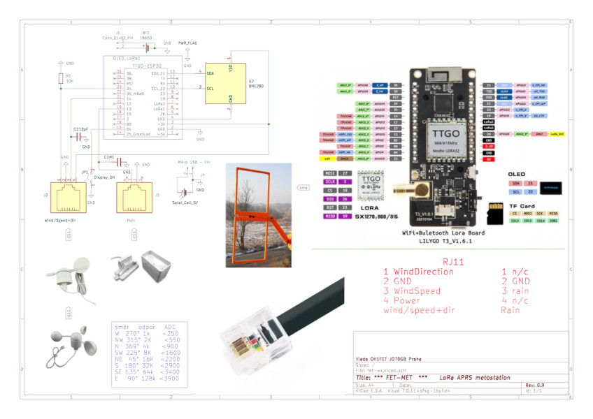

<!-- formatovani Markdown nebo html
kdyz neni obrazek 800x600 

Celkové schéma zapojení.

 
-->

# FetMet APRS amatérská LoRa meteostanice

🟥**Pozor změna používaní pinu 12 který branil programovaní ESP v PCB OPRAVENO**🟥

Meteostanice je postavena na vývojové desce ESP32 LILYGO T3 v1.6.1, která obsahuje integrovaný LoRa modul (433 MHz) a OLED displej. Díky tomu je celá konstrukce sondy výrazně zjednodušená.

Pro měření směru a rychlosti větru, srážek, atmosférického tlaku, teploty a vlhkosti stačí pouze tři elektronické součástky:
2× kondenzátor, 1× odpor a senzorový modul BME280.

Rychlost větru je měřena každých 20 sekund během intervalu 3 sekund.
Směr větru se vypočítává pomocí Yamartinova algoritmu, který vektorově zpracuje data a provádí korekci směrové odchylky.

Po 13 dvacetisekundových cyklech (tedy každých 5 minut) se provede měření tlaku, teploty a vlhkosti. Výsledná data jsou odesílána prostřednictvím sítě LoRa APRS.

Historická data lze sledovat online na:[www.aprs.fi](https://www.aprs.fi).

🌧️ Měření srážek
Srážky se detekují nepřetržitě s přesností 0,3 mm na impuls data se ukládají průběžně. Každých 5 minut (13 cyklus) se provede součet **12 a 288 polohového kruhového bufferu**, čímž získáme přehled za poslední hodinua den.

🔩 Použité senzory
Senzory pro vítr a srážky jsou převzaty z běžně dostupných meteostanic WH1080 / WH1090, které lze snadno zakoupit jako náhradní díly za přijatelnou cenu.

🧠 Software
Celý kód je bohatě okomentovaný a všechny výpočty jsou průběžně zobrazovány na sériové konzoli během běhu softwaru.

**Celkové schéma zapojení.**

Pohled na prototyp meteosondy MetFet 🙂.

**Doporučení pro solární provoz:**  
Vypni OLED úplně (jumper na GPIO4 propojen na GND)

Montáž sondy do vodotěsné krabičky.

Pohled na stranu plošného spoje.

## Spotřeba – naměřená na stole

| Režim                     | OLED zapnutý | OLED vypnutý (GPIO4 = LOW) |
|---------------------------|--------------|----------------------------|
| Deep-sleep                | 5,0 mA       | **1,9 mA**                 |
| Měření větru (3 s)        | 22 mA        | **19,5 mA**                |
| LoRa vysílání             | 89 mA        | **80 mA**                  |

Ukázka montáže za využití 3D tištěných dílů.

Detail konzole se senzory větru.

Testování J antény.

Upravené Moxon antény.

Orientační kalibrace srážkoměru za pomocí zahradního kolečka. 😅

## Co a jak přesně měří

| Velicina            | Rozlišení / přesnost               | Interval měření |
|---------------------|------------------------------------|-----------------|
| Rychlost větru      | 0,1 m/s (1 impuls ≈ 2,4 km/h)      | každých 20 s    |
| Směr větru          | 8 směrů + Yamartinův algoritmus    | každých 20 s    |
| Srážky              | 0,3 mm na impuls                   | nepřetržitě     |
| Teplota / vlhkost   | BME280                             | každých 5 min   |
| Atmosférický tlak   | BME280 (přepočet na hladinu moře)  | každých 5 min   |
| Napětí baterie      | 0,01 V                             | každých 5 min   |

Každých 5 minut se odesílá **plná APRS zpráva** (včetně `r000` a `p000`) → okamžitě vidět na  
https://aprs.fi/#!call=a%2FOK1FET-73

!!!U desky LILYGO není vyveden Vin pin. Zde je Vin bod pro připojení solárního panelu!!!
Nebo můžete solarní panel připojit přes mikro USB.

Průběh impulsu srážkoměru při změně za kondenzátor M1. Při 10pF občas detekovalo falešnou srážku!

Provozní zkoušky porovnávání nové sondy v přírodních podmínkách 💪😁

## Použité hlavvní komponenty
| Součástka                     | Kde koupit                                    | Cena cca |
|-------------------------------|-----------------------------------------------|----------|
| LILYGO T3 V1.6.1              | Laskakit, Aliexpress                          | 850 Kč   |
| BME280                        | Laskakit, GME                                 | 120 Kč   |
| Anemometr + směrovka WH1080   | Hadex, Aliexpress („WH1080 wind sensor“)      | 350 Kč   |
| Srážkoměr WH1080              | Hadex, Aliexpress („WH1080 rain gauge“)       | 350 Kč   |
| Solární panel 10×10 cm        | Aliexpress                                    | 150 Kč   |
| Li-Ion 18650                  | kdekoliv                                      | 100 Kč   |

**Celkem: 1600–1800 Kč**

