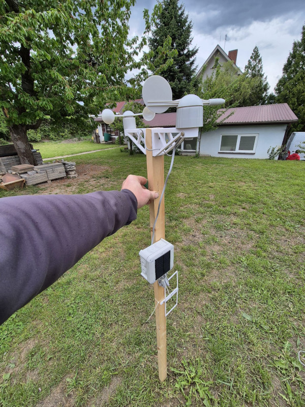

<h1>Fet MET Meteostanice</h1>

je postavena na vývojové desce ESP32 LILYGO T3 v1.6.1, která má integrovaný LoRa modul (433 MHz) a

OLED displej. Díky tomu se cela konstrukce značně zjednodušuje.

Pro měření směru a rychlosti větru, dešťových srážek, atmosférického tlaku, teploty a vlhkosti stačí 

jen minimální počet součástek – konkrétně:

2x kondenzátory

1x rezistor

1x senzor BME280

Data jsou přenášena prostřednictvím LoRa protokolu na server aprs.fi, kde je lze sledovat v reálném čase.

Senzory pro vítr a srážky jsou převzaty z komerčně dostupných meteostanic WH1080-90

, které lze snadno sehnat jako náhradní díly za přijatelnou cenu.

 

plspoj

 

oled spoj redbat

pcb

Jant

moxon

kolecko

vin

pilse

